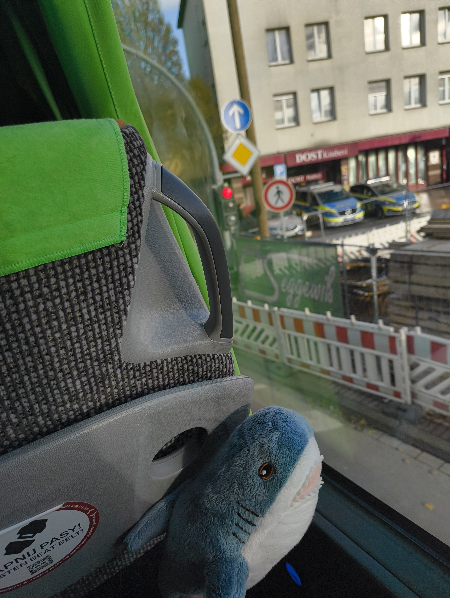
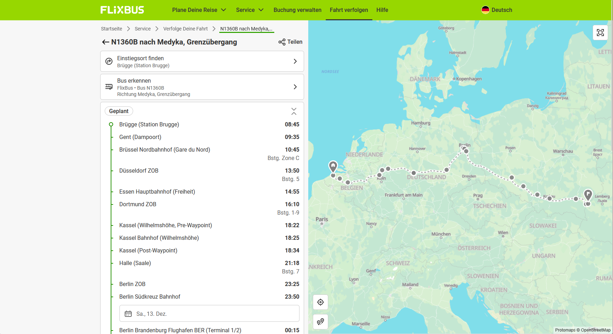

# Haix-la-Chapelle 2025

## Tiny Blåhaj: curious about the road ahead - OSINT

- **Author:** Tschotsch
- **Description:**<br>   
<p>Relieved to finally know where in which city it currently is, the tiny Blåhaj settled back into its seat. But soon, curiosity began to bubble up again — where was this green bus actually heading? What new adventures might await at the end of the line? The flag is haix{busline_final-destination} (i.e. haix{123c4_atlantis}, Tiny Blåhaj reminds you: the flag is all lowercase!). (This challenges is a continuation of "Tiny Blåhaj: lost and looking for help " and refers to the same data)<p>

- **Points:** 244
- **Solves:** 13

---

As we already know, the tiny Blåhaj is träwelling in a FlixBus and is currently somewhere in Dortmund.

The FlixBus website has a tracker available for which you can lookup nine days worth of rides on all their busses.
What we first thought was that maybe the bus started or had a stop in Aachen, as the organizers are based Aachen, home of the great Printe!

We noticed that on the challenge picture, the bus was going in the direction of the police station and the nearest FlixBus station is Dortmund ZOB which is where the bus is supposedly coming from.



So we searched and tried many buslines that started or had a stop in Aachen and Dortmund ZOB (the central bus station) to no avail.

After a while, one of our players asked if we had already checked the exif data and the group that was working on the challenge just groaned at our silly mistake.

Because for most OSINT challenges revolving around images, the most beginner 101 strategy is to first look at the metadata which we all forgot to check.

The metadata (EXIF) of the challenge picture revealed a timestamp (**2025:10:24 16:24:33**):
```
ExifTool Version Number         : 12.76
File Name                       : haj.jpg
Directory                       : .
File Size                       : 3.3 MB
File Modification Date/Time     : 2025:11:21 15:53:19+01:00
File Access Date/Time           : 2025:12:07 18:43:20+01:00
File Inode Change Date/Time     : 2025:12:07 18:43:19+01:00
File Permissions                : -rwxrwx---
File Type                       : JPEG
File Type Extension             : jpg
MIME Type                       : image/jpeg
Exif Byte Order                 : Little-endian (Intel, II)
Resolution Unit                 : inches
Image Description               : 
Make                            : Nothing
Camera Model Name               : A142
Software                        : MediaTek Camera Application
Orientation                     : Horizontal (normal)
Modify Date                     : 2025:10:24 16:24:33
Y Cb Cr Positioning             : Co-sited
Maker Note Unknown Text         : (Binary data 172 bytes, use -b option to extract)
Recommended Exposure Index      : 0
Sensitivity Type                : Unknown
ISO                             : 100
Exposure Program                : Program AE
F Number                        : 1.9
Exposure Time                   : 1/217
Sub Sec Time Digitized          : 374
Offset Time Digitized           : +02:00
Sub Sec Time Original           : 374
Offset Time Original            : +02:00
Sub Sec Time                    : 374
Offset Time                     : +02:00
Focal Length                    : 5.6 mm
Flash                           : No Flash
Light Source                    : Other
Metering Mode                   : Center-weighted average
Scene Capture Type              : Standard
Interoperability Index          : R98 - DCF basic file (sRGB)
Interoperability Version        : 0100
Focal Length In 35mm Format     : 0 mm
Max Aperture Value              : 1.9
Create Date                     : 2025:10:24 16:24:33
Exposure Compensation           : 0
Digital Zoom Ratio              : 1
Exif Image Height               : 4080
White Balance                   : Auto
Date/Time Original              : 2025:10:24 16:24:33
Brightness Value                : 5.1
Exif Image Width                : 3072
Exposure Mode                   : Auto
Aperture Value                  : 1.9
Components Configuration        : Y, Cb, Cr, -
Color Space                     : sRGB
Shutter Speed Value             : 1/217
Exif Version                    : 0220
Flashpix Version                : 0100
X Resolution                    : 72
Y Resolution                    : 72
Thumbnail Offset                : 1290
Thumbnail Length                : 27880
Compression                     : JPEG (old-style)
XMP Toolkit                     : Adobe XMP Core 5.1.2
Version                         : 1.0
Directory Item Semantic         : Primary
Directory Item Mime             : image/jpeg
Directory Item Length           : 39351
Profile CMM Type                : 
Profile Version                 : 4.3.0
Profile Class                   : Display Device Profile
Color Space Data                : RGB
Profile Connection Space        : XYZ
Profile Date Time               : 2025:10:24 14:24:35
Profile File Signature          : acsp
Primary Platform                : Unknown ()
CMM Flags                       : Not Embedded, Independent
Device Manufacturer             : Google
Device Model                    : 
Device Attributes               : Reflective, Glossy, Positive, Color
Rendering Intent                : Perceptual
Connection Space Illuminant     : 0.9642 1 0.82491
Profile Creator                 : Google
Profile ID                      : 61473528d5aaa311e143dfc93efaa268
Profile Description             : Display P3 Gamut with sRGB Transfer
Red Matrix Column               : 0.51512 0.2412 -0.00104
Green Matrix Column             : 0.29198 0.69225 0.04189
Blue Matrix Column              : 0.1571 0.06657 0.78407
Media White Point               : 0.9642 1 0.82491
Media Black Point               : 0 0 0
Red Tone Reproduction Curve     : (Binary data 40 bytes, use -b option to extract)
Green Tone Reproduction Curve   : (Binary data 40 bytes, use -b option to extract)
Blue Tone Reproduction Curve    : (Binary data 40 bytes, use -b option to extract)
Chromatic Adaptation            : 1.04788 0.02292 -0.05019 0.02959 0.99048 -0.01704 -0.00922 0.01508 0.75168
Profile Copyright               : Copyright (c) 2023 Google Inc.
MPF Version                     : 0100
Number Of Images                : 2
MP Image Flags                  : (none)
MP Image Format                 : JPEG
MP Image Type                   : Undefined
MP Image Length                 : 39351
MP Image Start                  : 3261193
Dependent Image 1 Entry Number  : 0
Dependent Image 2 Entry Number  : 0
Image Width                     : 3072
Image Height                    : 4080
Encoding Process                : Baseline DCT, Huffman coding
Bits Per Sample                 : 8
Color Components                : 3
Y Cb Cr Sub Sampling            : YCbCr4:2:0 (2 2)
Aperture                        : 1.9
Image Size                      : 3072x4080
Megapixels                      : 12.5
Shutter Speed                   : 1/217
Create Date                     : 2025:10:24 16:24:33.374+02:00
Date/Time Original              : 2025:10:24 16:24:33.374+02:00
Modify Date                     : 2025:10:24 16:24:33.374+02:00
Thumbnail Image                 : (Binary data 27880 bytes, use -b option to extract)
MP Image 2                      : (Binary data 39351 bytes, use -b option to extract)
Focal Length                    : 5.6 mm
Light Value                     : 9.6
```

Now having a timestamp we can cross-reference the weekday and time with the current FlixBus data (Friday, 16:24):



As we can see, the bus departed from Dortmund ZOB at 16:10 which lines up with our timestamp.

The final destination for this bus is Medyka, Poland.

So the final flag is haix{n1360b_medyka}