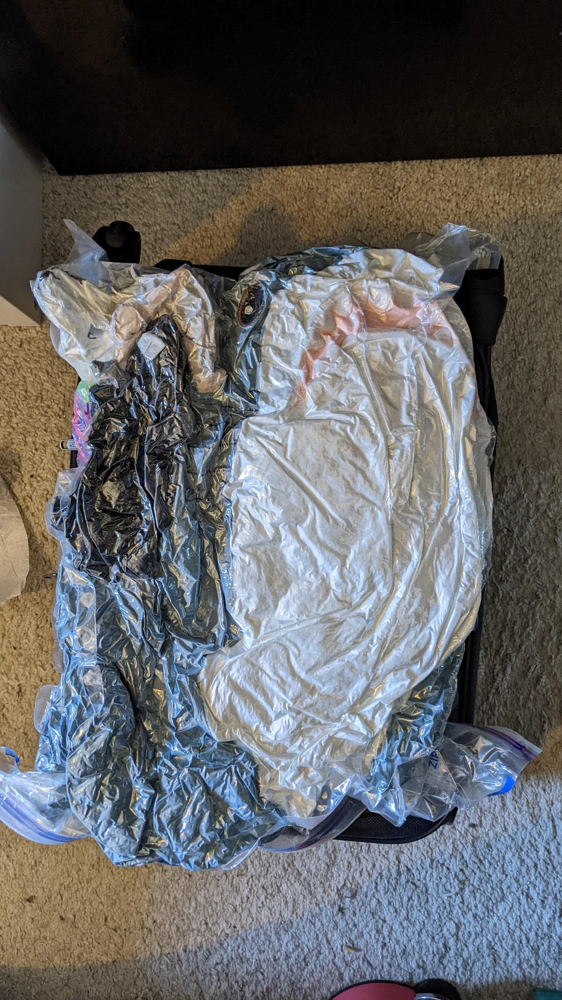
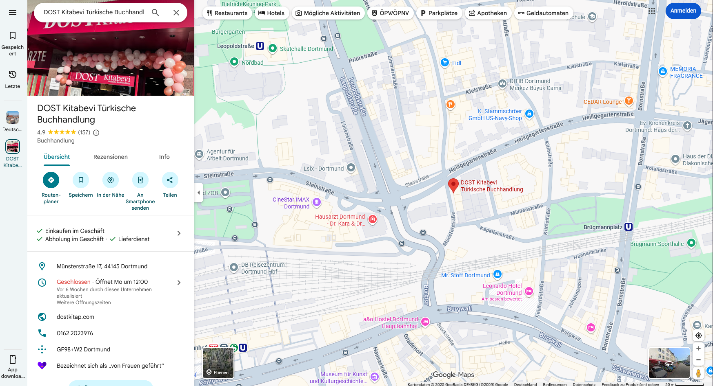
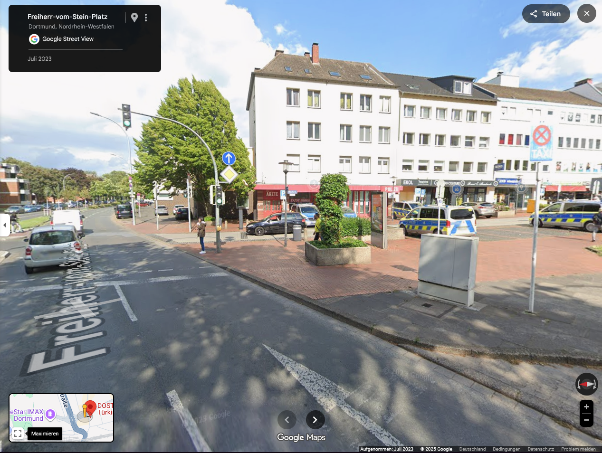
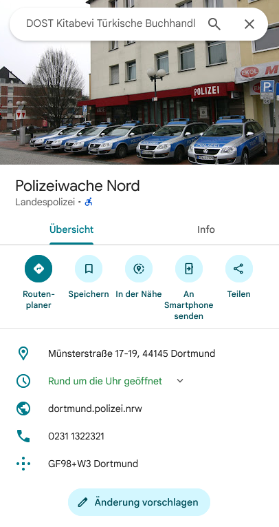

# Haix-la-Chapelle 2025

## Tiny Blåhaj: lost and looking for help - OSINT

- **Author:** Tschotsch
- **Description:**    

A tiny Blåhaj, curious and adventurous, decided one sunny morning to see the world. Spontaneously, it hopped into a bright green bus, thrilled by the possibilities ahead. As the vehicle rattled along unfamiliar streets, the little shark looked out the window, wondering where it might have ended up. Then, through the glass, it spotted a familiar station—the police! Blåhaj knew immediately: here were its friends and helpers. Relief washed over it, but the question remained: exactly where had it landed? 
The flag is haix{city_policestation} (i.e. haix{atlantis_polizeiwache_schwertwal}).

- **Points:** 100 
- **Solves:** 35

---

Upon first reading the description text, we instantly knew that the *bright green bus* can only mean the iconic busses by FlixBus! (Heimvorteil!)
But this information doesn't really help us here so lets look at the files provided to us.

We've been given a zip archive where we can see a deflated Blahaj :( and another zip archive.

Inside the archive we have the challenge picture:

We can see the police cars parking outside a building with some blurry text.

With the utmost perfect squinting of our eyes we can recognize the blurry text as **DOST Kitabevi**!

So searching for **DOST Kitabevi** on Google Maps, we get this location in Dortmund:

Going into Google Streetview we can see similar police cars parking outside of the book shop. But we notice that the sign of the shop is missing and then realize that the Streetview image was taken in 2023 and the challenge picture might be taken recently.

Zooming in on the book shop, we can see that just above that shop is another icon. The police station!

The final flag is: haix{dortmund_polizeiwache_nord}